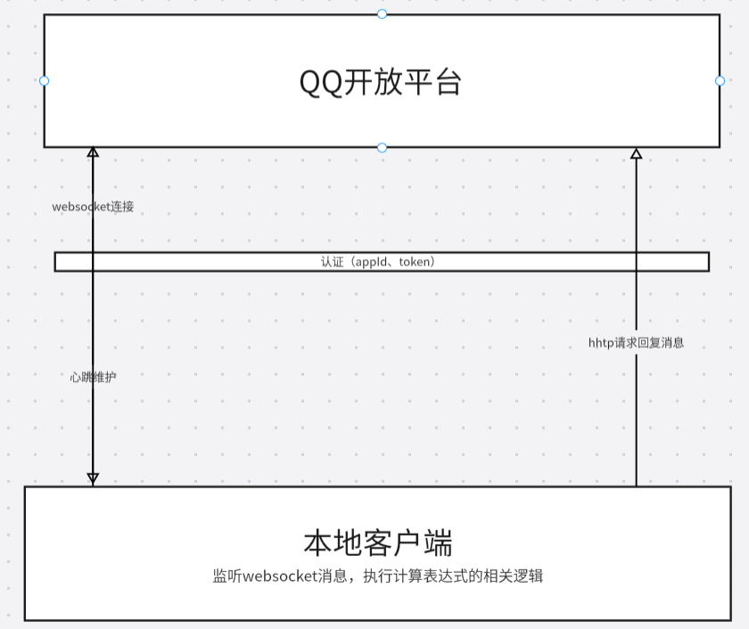

# 项目介绍

计数机器人：可以与QQ机器人对话，输入相关指令以及计算表达式，机器人会自动计算出结果回复

#### 使用文档：

##### 1、进入QQ频道

##### 2、进入聊天室

##### 3、@机器人并输入/计数 {表达式}

#### 设计文档：
##### 1、与QQ开放平台建立websocket链接通信，并维护心跳
##### 2、监听websocket消息，并执行相关事件
##### 3、执行计算表达式的业务逻辑
         3.1 解析消息内容，提取{}里面的表达式
         3.2 将中缀表达式转为后缀表达式
         3.3 进行后缀表达式的计算
##### 4、通过http请求进行消息的回复

#### 测试文档：
##### 1、@机器人提示

##### 2、@机器人并输入错指令

##### 3、@机器人并输入指令并输入错误表达式

##### 4、加法
##### 5、减法

##### 6、乘法

##### 7、除法

##### 8、复杂运算

